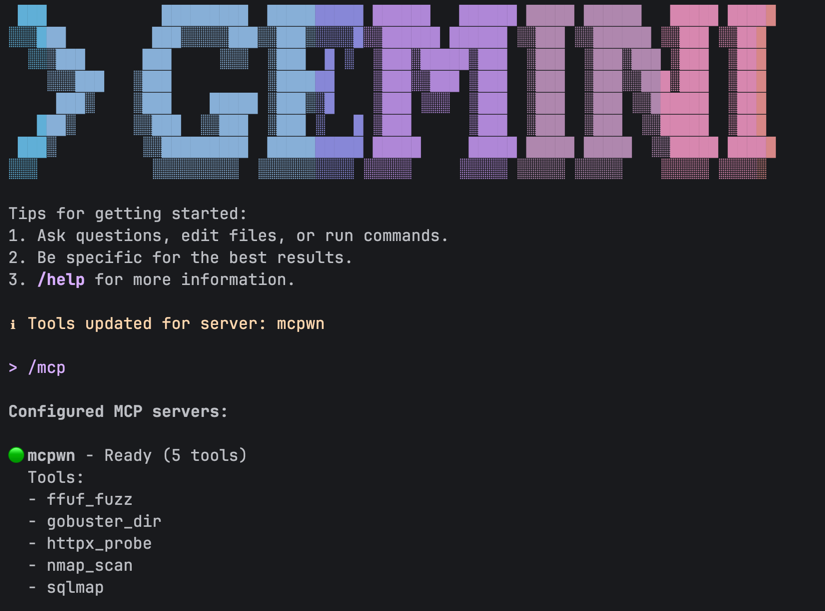

# mcpwn

**mcpwn** is an MCP server that allows Large Language Models (LLMs) to execute security tools on your local machine. It currently supports **5** tools out of the box: `nmap`, `gobuster`, `ffuf`, `httpx`, and `sqlmap`.

## Table of Contents

- [Features](#features)
- [Installation](#installation)
  - [Prerequisites](#prerequisites)
  - [Build from source](#build-from-source)
- [Security Warning](#security-warning)
- [Configuration](#configuration)
  - [Example mcpwn.yaml](#example-mcpwnyaml)
- [Usage](#usage)
  - [Run Manually](#run-manually)
  - [Integration with Claude and Gemini (WIP)](#integration-with-claude-and-gemini-wip)
- [Project Structure](#project-structure)
- [License](#license)

## Features

- **Model Context Protocol**: fully compliant with the Model Context Protocol. it uses the [modelcontextprotocol/go-sdk](https://github.com/modelcontextprotocol/go-sdk).
- **Dynamic tool registration**: define tools (like `nmap`, `gobuster`, etc...) via a simple `mcpwn.yaml` file.
- **Cross-platform**: compiles for Linux, macOS, and Windows.

## Installation

### Prerequisites and Info

- [Go 1.25](https://go.dev/dl/) or later.
- Docker

You can use `mcpwn` with your locally installed tools or with Docker (recommended).

If you decide not to use Docker, you can still use it but the security tools you want to use (e.g., `nmap`) must be installed and in your system `PATH`.

---
**Security Warning!**

This tool allows an LLM to execute commands on your machine.

**Only use it with models you trust and in environments where execution is safe.**
The tool implements basic safety checks, but it does not replace a proper sandbox.
---

### Build from source

```bash
git clone https://gitlab.com/parrotsec/project/mcpwn.git
cd mcpwn
go build -o mcpwn cmd/mcpwn/main.go
```

Furthermore, `mcpwn` is cross-platform, so you can build the project for GNU/Linux, macOS, and Windows. Please see `/scripts/build.sh`.

## Configuration

By default, `mcpwn` looks for a configuration file named `mcpwn.yaml` in the same directory as the executable. For system-wide installations, it also checks for a configuration file at `/etc/mcpwn/mcpwn.yaml`.

You can easily extend `mcpwn` by adding new tool definitions to this file. **Docker support** is also available: if you specify an `image` for a tool, `mcpwn` will automatically run it inside a temporary Docker container for increased security and isolation.

### Example `mcpwn.yaml`

```yaml
tools:
  - name: "nmap_scan"
    description: "Nmap is a free and open source utility for network discovery and security auditing."
    command: "nmap"
    args:
      - name: "target"
        description: "Target IP/Domain"
        required: true
        positional: true
      - name: "ports"
        description: "Ports to scan (e.g. '80,443' or '-p-')"
        flag: "-p"
      - name: "fast_mode"
        description: "Fast scan (-F)"
        flag: "-F"
        type: "boolean"
```

## Usage

### Run Manually

You can run the server directly to test if it loads your configuration correctly:

```bash
./mcpwn
```

The server communicates via `Stdio` and you will see log messages on `Stderr`.

### Integration with Claude and Gemini (WIP)

#### Claude Code

Run the following command in your terminal:
```bash
claude mcp add --transport stdio mcpwn -- /path/to/your/mcpwn
```

#### Gemini CLI

To use `mcpwn` with the [Gemini CLI](https://github.com/google-gemini/gemini-cli), follow these steps:

1. **Build the binary**:
   ```bash
   go build -o mcpwn cmd/mcpwn/main.go
   ```

2. **Register the server**: run the following command to add `mcpwn` to your Gemini CLI configuration (using your current absolute path):
   ```bash
   gemini mcp add mcpwn $(pwd)/mcpwn
   ```

3. **Start Gemini**:
   ```bash
   gemini
   ```
   

4. **Use**: inside the Gemini session, 
5. you can verify the connection by typing `/mcp list`. You can then ask the model to run your tools, e.g.:
   > Scan localhost using nmap_scan in fast mode.

*Note: If you modify `mcpwn.yaml`, you must restart the Gemini CLI session to refresh the tool definitions.*

## Project Structure

```
├── LICENSE
├── README.md
├── cmd
│   └── mcpwn
│       └── main.go
├── go.mod
├── go.sum
├── internal // logic for loading the YAML configuration.
│   ├── config
│   │   └── config.go
│   ├── executor
│   │   └── run.go
│   └── server // MCP protocol implementation and tool routing.
│       └── server.go
├── mcpwn.yaml
└── scripts
    └── build.sh
```

## License

This project is licensed under the GPL v3.

## Contact

For further information and implementation, please contact `danterolle@parrotsec.org` or `team@parrotsec.org`.